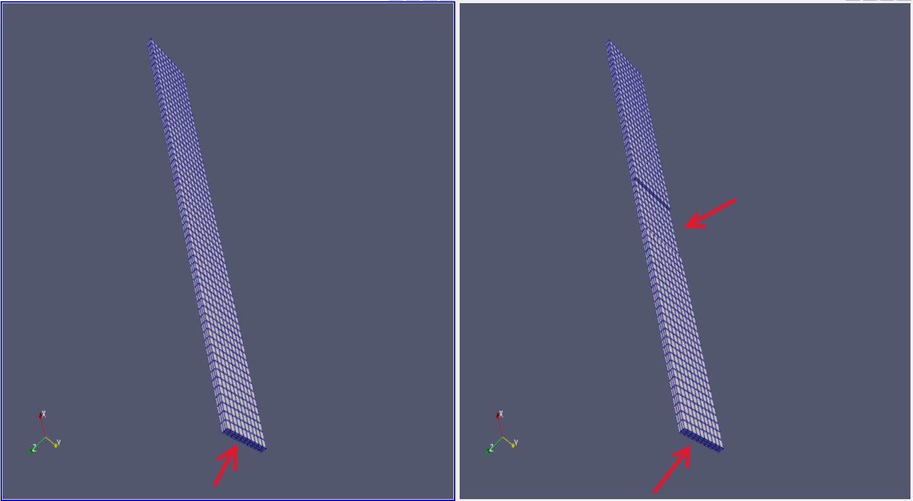

# 3D Modal Analysis for Defect Detection

## Aim

To investigate whether **3D modal analysis** (using both mode shapes and natural frequencies) can be used to detect defects in manufactured parts by comparing a **normal model** against a **defect model**.

- **Tool:** FEniCSx + Python + Viewing in Paraview + Jupyter Notebook
- **Defects:** Surface or sub-surface  
- **Application:** Quick "ping-like" screening in production line  

Further detailed NDT methods (liquid penetrant, radiography, eddy current) can be used for confirmation.

### Scope and Current Status

This work represents a **simple initial exploration**:

- The current model is a **first iteration** and requires refinement  
- Further work is needed to:
  - Determine the **smallest detectable defect size**  
  - Establish **sensitivity limits**  
  - Improve robustness for real-world use  

### Engineering Intent

The goal is **not a production-ready solution**, but to evaluate:
- Whether modal analysis can serve as a fast, global screening tool for defect detection.

---

## Problem Setup

- 3D cantilever beam (clamped at one end)  
- Undamped, linear, free vibration (modal analysis), but not free-free modal analysis  
- Full 3D solid model (not a beam approximation)  
- First order elements used
- Material is linear (modal analysis assumes linear elasticity)

### Governing Equation

&nbsp;&nbsp;&nbsp;&nbsp;&nbsp;&nbsp;**K u = λ M u**

Where:
- `K` = stiffness matrix  
- `M` = mass matrix  
- `λ` = eigenvalue (related to frequency)  
- `u` = eigenvector (mode shape)  

### Geometry and Mesh

*Structured 3D mesh. Thin geometry with clamped boundary at one end (end closer to origin).*
*Defect is simulated as material removed (elements removed). This is a very quick and simplistic methodology.*

---

## Defect Modeling

- Defect simulated by **removing elements**
- Represents local stiffness loss

### Physical Effect of Defect

- Reduction in stiffness  
- Lower natural frequencies  
- Distortion in mode shapes (**primary indicator**)  

---

## Weak Formulation

&nbsp;&nbsp;&nbsp;&nbsp;&nbsp;&nbsp;**∫_Ω σ(u) : ε(v) dx**

### Strain Tensor

&nbsp;&nbsp;&nbsp;&nbsp;&nbsp;&nbsp;**ε(u) = 1/2 (∇u + ∇uᵀ)**

### Stress Tensor (Hooke’s Law, isotropic)

&nbsp;&nbsp;&nbsp;&nbsp;&nbsp;&nbsp;**σ(u) = λ tr(ε(u)) I + 2μ ε(u)**

### Boundary Condition

&nbsp;&nbsp;&nbsp;&nbsp;&nbsp;&nbsp;**u = 0 (on clamped boundary; Dirichlet Boundary Condition)**

---

## Modeling Assumptions

- 3D linear elasticity  
- Small strain formulation  
- Isotropic material  
- No damping  

Based on classical formulations from:
- Timoshenko & Goodier – *Theory of Elasticity*  
- Zienkiewicz – *Finite Element Method*  

---

## Modal Analysis

- Solver: SLEPc eigenvalue solver  
- Problem type: **Generalized Hermitian Eigenvalue Problem (GHEP)**  
- System: **Undamped**  

Outputs:
- Natural frequencies  
- Mode shapes  

*Change in Mode shapes used to detect distortion due to defects.*

---

## Results

sdfgs
fsdfs

---

## Defect Detection Insight

- Frequency shift -> global stiffness change  
- Mode shape distortion -> global and local defect indicator (**primary focus**)  

---

## Validation

Analytical reference (Euler–Bernoulli beam theory):

&nbsp;&nbsp;&nbsp;&nbsp;&nbsp;&nbsp;**f_n = (β_n² / 2πL²) √(EI / ρA)**

### Observations

- ~15–25% deviation from analytical solution  
- FEM predicts slightly higher frequencies  

### Reason for Difference

- 3D solid model vs 1D beam theory  
- Shear deformation included in FEM  
- Finite thickness effects  
- Mesh resolution (3 elements through thickness; 5 elements can be tried too)  

---

## Numerical Notes

- ~0.159 Hz modes -> numerical artifacts (rigid-body-like)  
- These are ignored in interpretation  

---

## Conclusion

- FEM results show good agreement with theory  
- Correct stiffness and mass formulation  
- Proper boundary conditions  
- Reliable modal predictions  

---

## Future Work

- Improve defect detection sensitivity
- Try with 2nd order elements (see if stiffness and frequency reduces and matches more with analytical values)
- Quantify minimum detectable defect size
- Extend work to strength, fatigue, fracture (LEFM), and creep (dwell effects), impact analyses 
- Introduce damping effects, to see how the vibration dies out over time. The vibration die out signature may be helpful in fine tuning the defect detection. This damping effect may help in increasing the detection sensitivity.

---

